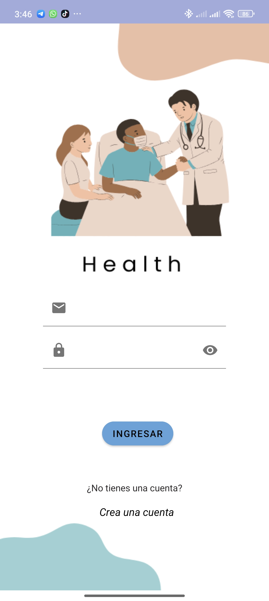
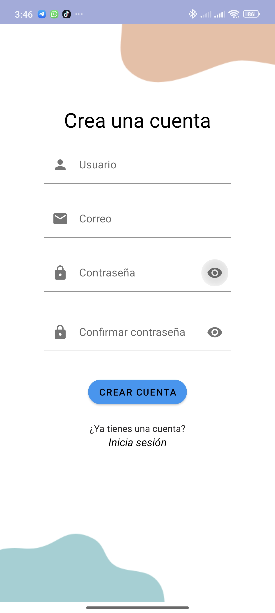
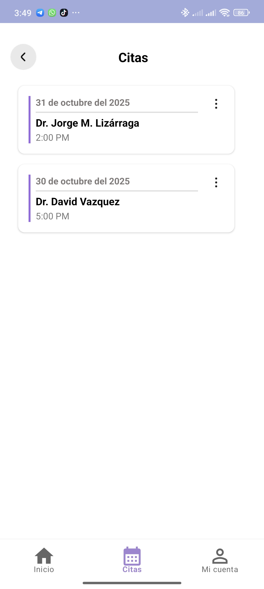

# 🏥 Consultorio Médico App
Esta aplicación móvil esta desarrollada en Kotlin con IntelliJ IDEA, permite gestionar citas médicas de manera sencilla y eficiente. Está conectado con Firebase Realtime Database para el manejo en tiempo real de usuarios, doctores, categorías y citas.

Usa **Firebase Realtime Database** para almacenar datos en tiempo real y **Firebase Authentication** para gestionar usuarios.

---

## Características principales

 **Registro e inicio de sesión de usuarios** con Firebase Auth  
 **Agenda, edita y elimina las citas médicas** 
 **Visualización de doctores y especialidades médicas**  
 **Selector de fecha y hora interactivo**  
 **Base de datos en tiempo real (Firebase)**  

---

## Tecnologías utilizadas

- **Lenguaje:** Kotlin  
- **IDE:** IntelliJ IDEA / Android Studio  
- **Base de datos:** Firebase Realtime Database  
- **Autenticación:** Firebase Authentication  

---

## Capturas de la aplicación

### Pantalla intro, login, signin

 
  
  

 

### Doctores 

  

 

### Agendar Cita 

  

---

## Flujo de la aplicación

1. El usuario inicia sesión o se registra.  
2. En la pantalla principal se muestran las categorías médicas.  
3. Al seleccionar una categoría, se filtran los doctores correspondientes.  
4. Se puede ver el detalle del doctor y **agendar una cita** seleccionando fecha y hora.  
5. En la sección de **Mis citas**, el usuario puede editar o eliminar sus citas.

---

## Desarrollado por

**Paty Leyva y Laura Padilla**  
---

